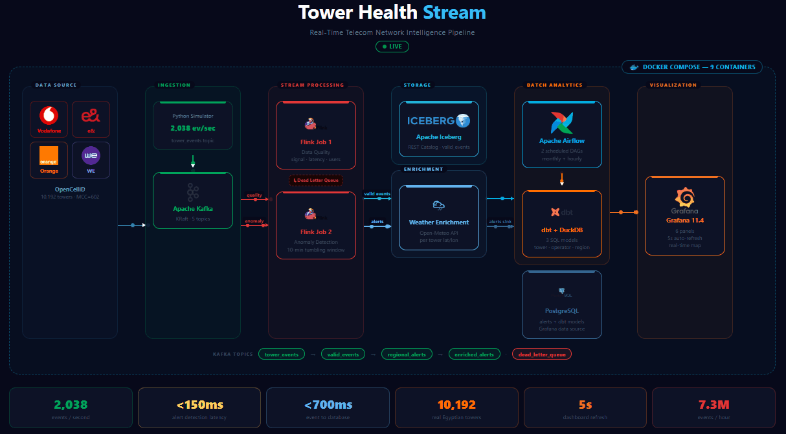

# Tower Health Stream


[](https://kafka.apache.org/)
[](https://flink.apache.org/)
[](https://airflow.apache.org/)
[](https://iceberg.apache.org/)
[](https://www.getdbt.com/)
[](https://grafana.com/)
[](https://www.postgresql.org/)
[](https://python.org/)
[](https://docker.com/)
[](LICENSE)

**Real-Time Telecom Network Intelligence Pipeline**

A real-time telecom network intelligence pipeline that detects cell tower degradation before customers experience service disruption. The system continuously processes live telemetry from 10,192 real Egyptian cell towers at a sustained rate of **2,038 events per second**, detects anomalies within **150 milliseconds** of ingestion, enriches alerts with live weather context, and surfaces results on an interactive Grafana dashboard that refreshes every 5 seconds.

---

## Performance

| Metric | Value |
|--------|-------|
| Throughput | 2,038 events / second |
| Throughput | 122,304 events / minute |
| Throughput | ~7.3 million events / hour |
| Event-to-alert detection latency | < 150 ms |
| Event-to-PostgreSQL latency | < 700 ms |
| End-to-end pipeline latency (event to dashboard) | ~6 seconds |
| Towers monitored | 10,192 real towers (Egypt, MCC=602) |
| Anomaly simulation rate | 5% of all events |

### Latency Breakdown

| Stage | Latency |
|-------|---------|
| Simulator to Kafka (tower_events) | < 10 ms |
| Kafka to Flink data quality job | < 50 ms |
| Flink to Kafka (valid_events) | < 20 ms |
| Kafka to Flink anomaly detection | < 50 ms |
| Flink to Kafka (regional_alerts) | < 20 ms |
| Kafka to weather enrichment (includes Open-Meteo API call) | < 500 ms |
| Kafka to alerts_sink to PostgreSQL | < 40 ms |
| PostgreSQL to Grafana dashboard | 5 seconds (dashboard refresh interval) |

---

## What It Does

Most telecom monitoring systems are reactive: they alert engineers after customers have already started complaining. This pipeline flips that model by detecting degradation signals in the raw telemetry stream and correlating them with live weather data, all before the issue reaches a threshold that impacts service quality.

When a tower shows a weak signal, the system classifies the root cause within 150 milliseconds: is it a technical fault, or is poor weather a contributing factor? That distinction changes how an operations team responds, and it is what makes real-time enrichment valuable beyond simple threshold alerting.

---

## Architecture

The pipeline is organized into four stages: ingestion, stream processing, batch analytics, and visualization.

```
Tower Simulator
  Reads 10,192 real towers from OpenCelliD
  Emits full cycle every 5 seconds (2,038 events/sec sustained)
        |
        v
Apache Kafka (KRaft mode, no ZooKeeper)
  tower_events -> valid_events -> regional_alerts -> enriched_alerts
        |
        |--- Flink Job 1: Data Quality
        |      Validates signal strength, latency, connected users
        |      Valid events   -> valid_events topic
        |      Invalid events -> dead_letter_queue topic
        |
        |--- Flink Job 2: Anomaly Detection
        |      Classifies: WEAK_SIGNAL, HIGH_DROP_RATE,
        |                  HIGH_LATENCY, OVERLOADED
        |      Regional aggregation: 10-minute tumbling window
        |      3+ affected towers in same area -> REGIONAL_OUTAGE
        |      Output -> regional_alerts topic
        |
        |--- Iceberg Sink
               Persists valid_events to Apache Iceberg table
               Supports time-travel queries and schema evolution

Weather Enrichment Service (Python, runs on host)
  Reads from regional_alerts
  Calls Open-Meteo API per tower lat/lon
  Computes weather_impact (HIGH / MEDIUM / LOW)
  Appends human-readable conclusion
  Output -> enriched_alerts topic

Parallel sinks (both read from Kafka, write to PostgreSQL):
  alerts_sink.py          -> realtime_alerts table
  enriched_alerts_sink.py -> enriched_alerts table

Grafana reads from PostgreSQL, refreshes every 5 seconds.

Batch layer (runs independently):
  Airflow DAG 1: Monthly OpenCelliD data refresh
  Airflow DAG 2: Hourly weather batch sampling (100 towers)
  dbt on DuckDB: Three transformation models exported to PostgreSQL
```

---

## Technology Stack

| Layer | Technology | Version | Role |
|-------|-----------|---------|------|
| Message Broker | Apache Kafka (KRaft) | 4.0.0 | Durable partitioned event streaming, no ZooKeeper dependency |
| Stream Processing | Apache Flink | 2.0.0 | Stateful anomaly detection, windowed regional aggregation |
| Table Storage | Apache Iceberg + REST Catalog | Latest | ACID-compliant open table format for valid events |
| Orchestration | Apache Airflow | 2.10.3 | Scheduled batch pipelines and DAG management |
| SQL Transformation | dbt-core + dbt-duckdb | 1.11.7 | Declarative SQL models compiled against DuckDB |
| Analytical Engine | DuckDB | 1.5.0 | Embedded OLAP engine powering dbt transformations |
| Visualization | Grafana | 11.4.0 | Real-time dashboard with geo-map and table panels |
| Serving Database | PostgreSQL | 13 | Grafana data source for both live and batch data |
| Infrastructure | Docker Compose | Latest | Fully containerized local environment (9 services) |
| Simulation and Enrichment | Python | 3.12 | Tower simulator, weather enrichment, alert sinks |

---

## Data Source

**OpenCelliD** is the world's largest open-source database of cell tower locations. The dataset used in this project covers all Egyptian cell towers (MCC=602), cleaned to retain only the four major network operators.

| Operator | Towers | Radio Types |
|----------|--------|------------|
| Vodafone Egypt | 4,791 | LTE, UMTS, GSM |
| e& (Etisalat) | 2,774 | LTE, UMTS, GSM |
| Orange Egypt | 2,212 | LTE, UMTS, GSM |
| WE (Telecom Egypt) | 415 | LTE, UMTS, GSM |
| **Total** | **10,192** | All radio types |

---

## Kafka Topics

| Topic | Partitions | Producer | Consumer | Purpose |
|-------|-----------|---------|---------|---------|
| tower_events | 3 | Tower Simulator | Flink Job 1 | Raw telemetry from all towers |
| valid_events | 3 | Flink Job 1 | Flink Job 2, Iceberg Sink | Quality-validated events |
| dead_letter_queue | 1 | Flink Job 1 | Monitoring | Malformed or out-of-range events |
| regional_alerts | 3 | Flink Job 2 | Weather Enrichment, Alerts Sink | Tower and regional anomaly alerts |
| enriched_alerts | 3 | Weather Enrichment | Enriched Alerts Sink | Alerts with live weather context |

---

## Stream Processing

### Data Quality (Flink Job 1)

Filters every incoming event against the following thresholds before forwarding to downstream consumers.

| Field | Valid Range |
|-------|------------|
| signal_strength | -120 to 0 dBm |
| latency_ms | greater than 0 |
| connected_users | 0 or greater |

Events that fail validation are routed to the `dead_letter_queue` topic for inspection.

### Anomaly Detection (Flink Job 2)

Classifies validated events into alert types at the tower level, then aggregates across geographic areas using a 10-minute tumbling window.

| Alert Type | Condition | Level |
|-----------|-----------|-------|
| WEAK_SIGNAL | signal_strength < -90 dBm | Tower |
| HIGH_DROP_RATE | call_drop_rate > 5% | Tower |
| HIGH_LATENCY | latency_ms > 200 ms | Tower |
| OVERLOADED | signal < -90 dBm and connected_users > 800 | Tower |
| REGIONAL_OUTAGE | 3 or more towers in same area alert within 10-minute window | Regional |

### Why Tumbling Windows

A tumbling window divides the stream into fixed, non-overlapping time buckets. Each 10-minute window is evaluated independently, which means regional aggregation produces one clean result per window rather than continuously updating counts. This avoids double-counting events and keeps the regional outage logic deterministic.

---

## Weather Enrichment

Enrichment runs per tower location using the Open-Meteo API (free, no API key required). Precipitation, wind speed, and cloud cover are evaluated to determine whether weather is a contributing factor to the detected anomaly.

| Impact Level | Condition | Conclusion |
|-------------|-----------|-----------|
| HIGH | Rain > 5 mm/h or wind > 40 km/h | Weather is the main cause |
| MEDIUM | Rain > 1 mm/h or wind > 20 km/h or cloud cover > 80% | Weather may be a partial cause |
| LOW | All other conditions | Technical issue, not weather related |

This distinction is operationally significant. A WEAK_SIGNAL alert caused by weather requires a different response than one caused by hardware degradation. The enrichment layer makes that distinction available to the dashboard in near real time.

---

## Batch Analytics (dbt Models)

Three SQL transformation models run against DuckDB and are exported to PostgreSQL for Grafana.

| Model | Description | Key Columns |
|-------|------------|------------|
| tower_health_scores | Assigns a health score per tower based on radio technology. LTE scores highest, GSM lowest. | tower_id, operator, radio, health_score, performance_rank |
| operator_performance | Aggregates tower counts and LTE coverage percentage per operator, ranked by 4G share. | operator, total_towers, lte_pct, umts_pct, gsm_pct, performance_rank |
| regional_risk_index | Calculates a risk score per geographic area based on the proportion of legacy non-LTE towers. | area, total_towers, lte_coverage_pct, risk_level, risk_score |

---

## Grafana Dashboard

The Tower Health Dashboard is available at `http://localhost:3000` and contains six panels.

| Panel | Type | Data | Refresh |
|-------|------|------|---------|
| Tower Alerts Map | Geomap | realtime_alerts joined with enriched_alerts | 5 seconds |
| Real-time Alerts | Table | realtime_alerts | 5 seconds |
| Weather Impact Alerts | Table | enriched_alerts | 5 seconds |
| Tower Health Scores by Operator | Bar chart | tower_health_scores (dbt) | On dbt run |
| Operator Performance | Bar chart | operator_performance (dbt) | On dbt run |
| Regional Risk Index | Bar chart | regional_risk_index (dbt) | On dbt run |

### Map Color Coding

| Color | Alert Type | Meaning |
|-------|-----------|---------|
| Yellow | WEAK_SIGNAL | Signal below -90 dBm |
| Red | HIGH_DROP_RATE | Call drop rate above 5% |
| Orange | HIGH_LATENCY | Latency above 200 ms |
| Blue | OVERLOADED | Weak signal with more than 800 connected users |
| Purple | WEATHER_RELATED | Any alert where weather impact is MEDIUM or HIGH |

---

## Running Locally

### Prerequisites

- Docker and Docker Compose
- Python 3.12 with: `kafka-python`, `psycopg2`, `pyiceberg`, `duckdb`, `pandas`, `requests`
- dbt-core and dbt-duckdb

### Step 1: Clone and start infrastructure

```bash
git clone https://github.com/A7mdGamel/tower-health-stream.git
cd tower-health-stream
docker compose -f docker/docker-compose.yml up -d
```

### Step 2: Add tower data

Download Egypt towers (MCC=602) from [OpenCelliD](https://opencellid.org/), place the CSV at `data/towers_raw.csv`, then run:

```bash
python3 simulator/data_cleaner.py
# Output: data/towers_clean.csv (10,192 towers)
```

### Step 3: Create Kafka topics

```bash
docker exec kafka /opt/kafka/bin/kafka-topics.sh --create --bootstrap-server localhost:9092 --topic tower_events --partitions 3 --replication-factor 1
docker exec kafka /opt/kafka/bin/kafka-topics.sh --create --bootstrap-server localhost:9092 --topic valid_events --partitions 3 --replication-factor 1
docker exec kafka /opt/kafka/bin/kafka-topics.sh --create --bootstrap-server localhost:9092 --topic dead_letter_queue --partitions 1 --replication-factor 1
docker exec kafka /opt/kafka/bin/kafka-topics.sh --create --bootstrap-server localhost:9092 --topic regional_alerts --partitions 3 --replication-factor 1
docker exec kafka /opt/kafka/bin/kafka-topics.sh --create --bootstrap-server localhost:9092 --topic enriched_alerts --partitions 3 --replication-factor 1
```

### Step 4: Submit Flink jobs

```bash
docker exec flink-jobmanager flink run -py /opt/flink/jobs/data_quality.py
docker exec flink-jobmanager flink run -py /opt/flink/jobs/anomaly_detection.py
```

### Step 5: Start Python services (separate terminals)

```bash
python3 simulator/tower_simulator.py
python3 flink_jobs/weather_enrichment.py
python3 iceberg/iceberg_sink.py
python3 grafana/alerts_sink.py
python3 grafana/enriched_alerts_sink.py
```

### Step 6: Run dbt transformations

```bash
cd dbt_project && dbt run
```

---

## Service Endpoints

| Service | URL | Credentials |
|---------|-----|------------|
| Grafana Dashboard | http://localhost:3000 | admin / admin |
| Kafka UI | http://localhost:8080 | None |
| Flink Dashboard | http://localhost:8081 | None |
| Airflow | http://localhost:8082 | admin / admin |
| Iceberg REST Catalog | http://localhost:8182 | None |

---

## Project Structure

```
tower-health-stream/
|
|-- simulator/
|   |-- tower_simulator.py          Emits real tower telemetry to Kafka every 5 seconds
|   `-- data_cleaner.py             Cleans raw OpenCelliD CSV into towers_clean.csv
|
|-- flink_jobs/
|   |-- data_quality.py             Flink job: signal validation and dead-letter routing
|   |-- anomaly_detection.py        Flink job: alert classification and regional aggregation
|   |-- weather_enrichment.py       Enriches alerts with live Open-Meteo weather data
|   `-- jars/
|       `-- flink-sql-connector-kafka-4.0.1-2.0.jar
|
|-- iceberg/
|   `-- iceberg_sink.py             Writes valid events to the Iceberg table
|
|-- dags/
|   |-- opencellid_refresh.py       Airflow DAG: monthly tower data refresh
|   `-- weather_batch.py            Airflow DAG: hourly weather sampling for 100 towers
|
|-- dbt_project/
|   `-- models/
|       |-- tower_health_scores.sql
|       |-- operator_performance.sql
|       `-- regional_risk_index.sql
|
|-- grafana/
|   |-- alerts_sink.py              Streams regional alerts to PostgreSQL for Grafana
|   `-- enriched_alerts_sink.py     Streams weather-enriched alerts to PostgreSQL
|
|-- docker/
|   |-- docker-compose.yml          Full infrastructure definition (9 services)
|   `-- Dockerfile.flink            Custom Flink image with PyFlink and Kafka connector JAR
|
|-- data/                           Not tracked in Git
|   `-- towers_clean.csv            10,192 Egyptian towers
|
`-- docs/
    `-- architecture.md
```

---

## License

This project is licensed under the MIT License, see the [LICENSE](LICENSE) file for details.

## Attribution

If you use or build upon this project, attribution is highly appreciated:

> Based on Tower Health Stream by Ahmed Gamel  
> https://github.com/A7mdGamel/tower-health-stream

## Author

Ahmed Gamel — https://github.com/A7mdGamel
